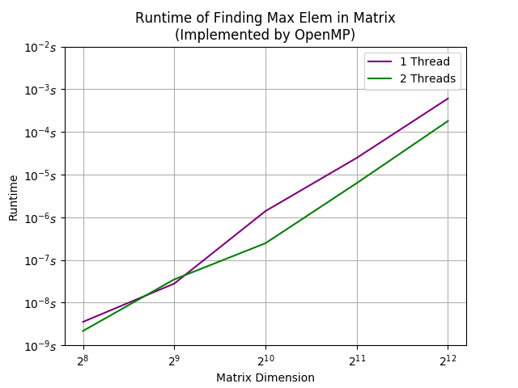


# Openmp实现求矩阵元素最大值

**计试61 张翀 2140506063**

## 题目
Create a program that computes the sum of all the elements in an array A (in fortran or C/C++) or a program that finds the largest number in an array A (Fortran) . Use OpenMP directives to make it run in parallel
## 思路
首先求每一行的最大值，再在这些最大值中取最大值。其中，求每一行的最大值操作是独立的，可以并行执行。
## 代码
核心命令：`#pragma omp parallel for num_threads(num_threads)`
这条命令的含义是，紧跟代码的for循环被多个线程并行执行，线程数由参数`num_threads`确定。在两层for循环中，第一层的含义是各行依次求最大值，这个过程可以并行执行；第二层的含义是逐个比较元素而获得最大值，这个过程是串行过程。因此，应该并行第一层for循环。
为方便测试时间，设计函数`matGene`生成指定大小的矩阵，`vecGene`生成指定大小的向量，生成矩阵之后求乘积，再输出结果。设计代码如下：
```cpp
```
## 实验结果

使用如下命令编译并执行：`g++ -fopenmp main.cpp && ./a.out mat_dim num_threads`，执行可执行文件时带的两个参数分别是矩阵维度和使用的线程数。
测试时间如下：

| 线程数 | 1 | 2 | 并行加速比
| :----: | :----: | :----: | :----: |
| 256 | 0.0002887 | 0.0002335 | 1.2364 |
| 512 | 0.0007073 | 0.0007808 | 0.9059 |
| 1024 | 0.0034686 | 0.0018217 | 1.9040 |
| 2048 | 0.0134514 | 0.0074485 | 1.8059 |
| 4096 | 0.0540589 | 0.0319176 | 1.6937 |
表格中最左侧一栏为测试时矩阵维度，表格中时间单位为秒。



以上为程序运行时间的测试结果展示，为方便展示，横纵坐标均取对数。由图像可见两点：
* 通过直线的大致斜率可见，求最大值的算法是O(n^2)的；
* 通过2线程并行执行程序，程序确实能获得近似为2的加速比；
* 因为在维度数较小时，最后一步无法线性化的操作占用总时间较长，所以此时的加速比较低。
